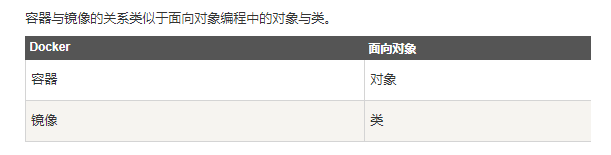
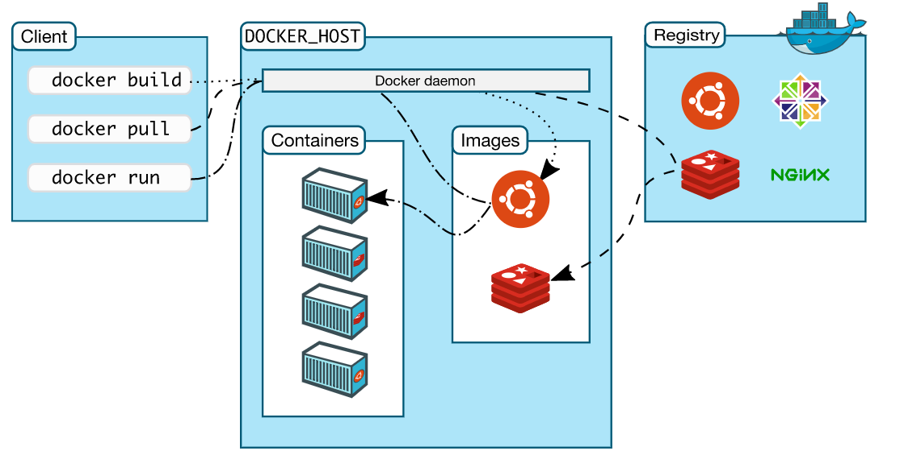
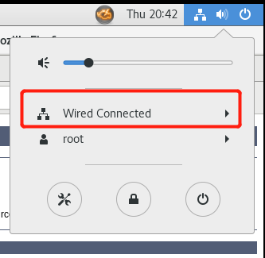
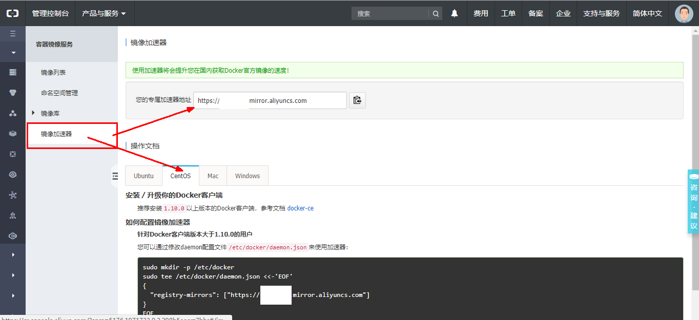
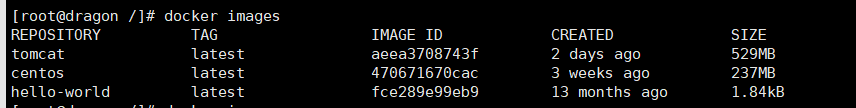
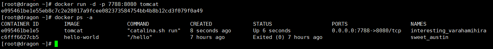
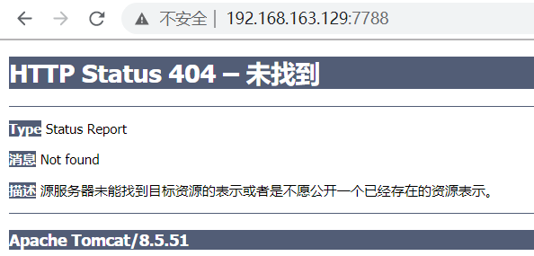
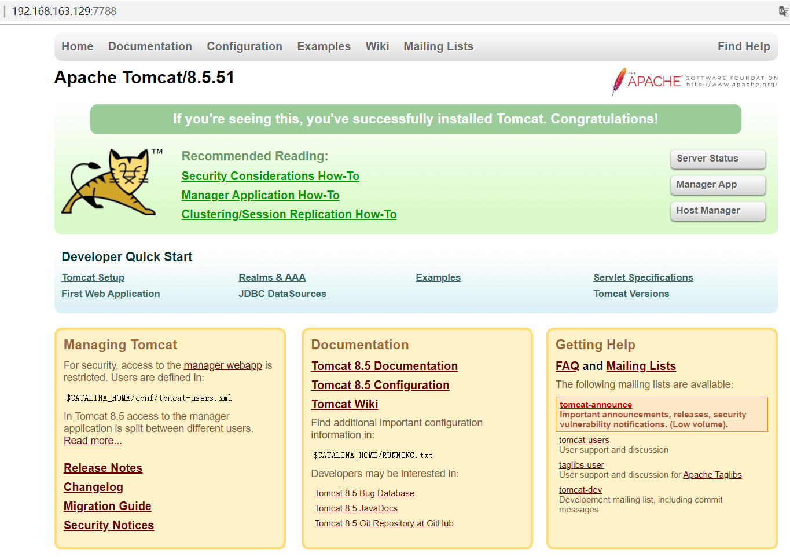

# Docker入门 

## Docker简介

 Docker是一个用于开发，交付和运行应用程序的开放平台。Docker使您能够将应用程序与基础架构分开，从而可以快速交付软件。借助Docker，您可以以与管理应用程序相同的方式来管理基础架构。通过利用Docker的快速交付，测试和部署代码的方法，您可以大大减少编写代码和在生产环境中运行代码之间的延迟。 

## Docker安装

### Docker的基本组成

- 镜像（image）

  Docker 镜像（Image）就是一个只读的模板。镜像可以用来创建 Docker 容器，一个镜像可以创建很多容器。

  

- 容器（container）

  Docker 利用容器（Container）独立运行的一个或一组应用。容器是用镜像创建的运行实例。

  它可以被启动、开始、停止、删除。每个容器都是相互隔离的、保证安全的平台。

  可以把容器看做是一个简易版的 Linux 环境（包括root用户权限、进程空间、用户空间和网络空间等）和运行在其中的应用程序。

  容器的定义和镜像几乎一模一样，也是一堆层的统一视角，唯一区别在于容器的最上面那一层是可读可写的。

- 仓库（repository）

  仓库（Repository）是集中存放镜像文件的场所。
  仓库(Repository)和仓库注册服务器（Registry）是有区别的。仓库注册服务器上往往存放着多个仓库，每个仓库中又包含了多个镜像，每个镜像有不同的标签（tag）。

  仓库分为公开仓库（Public）和私有仓库（Private）两种形式。
  最大的公开仓库是 Docker Hub(https://hub.docker.com/)，
  存放了数量庞大的镜像供用户下载。国内的公开仓库包括阿里云 、网易云 等

- 小总结

  需要正确的理解仓储/镜像/容器这几个概念:

   Docker 本身是一个容器运行载体或称之为管理引擎。我们把应用程序和配置依赖打包好形成一个可交付的运行环境，这个打包好的运行环境就似乎 image镜像文件。只有通过这个镜像文件才能生成 Docker 容器。image 文件可以看作是容器的模板。Docker 根据 image 文件生成容器的实例。同一个 image 文件，可以生成多个同时运行的容器实例。

  *  image 文件生成的容器实例，本身也是一个文件，称为镜像文件。

  *  一个容器运行一种服务，当我们需要的时候，就可以通过docker客户端创建一个对应的运行实例，也就是我们的容器

  * 至于仓储，就是放了一堆镜像的地方，我们可以把镜像发布到仓储中，需要的时候从仓储中拉下来就可以了。

### Docker的架构图



### CentOS7安装Docker

安装步骤:

1. 官网中文安装参考手册:[](https://docs.docker-cn.com/engine/installation/linux/docker-ce/centos/#prerequisites)

2. 确定你是CentOS7及以上版本  cat /etc/redhat-release

3. yum安装gcc相关

   - CentOS7能上外网

     

   - yum -y install gcc

   - yum -y install gcc-c++

4. 卸载旧版本  yum -y remove docker docker-common docker-selinux docker-engine

5. 安装需要的软件包  yum install -y yum-utils device-mapper-persistent-data lvm2

6. 设置stable镜像仓库  yum-config-manager --add-repo http://mirrors.aliyun.com/docker-ce/linux/centos/docker-ce.repo

7. 更新yum软件包索引  yum makecache fast

8. 安装DOCKER CE  yum -y install docker-ce

9. 启动docker  systemctl start docker

10. 测试

    - docker version
    - docker run hello-world

11. 卸载

    - systemctl stop docker 
    - yum -y remove docker-ce
    - rm -rf /var/lib/docker

### 永远的HelloWorld

1. 阿里云镜像加速（地址：[](https://dev.aliyun.com/search.html)）

2. 获得加速器地址连接

   

3. 配置本机Docker运行镜像加速器（CentOS7版本）

   - mkdir -p /etc/docker

   - vim  /etc/docker/daemon.json

     #网易云
     {"registry-mirrors": ["http://hub-mirror.c.163.com"] }

      

      #阿里云
     {
       "registry-mirrors": ["https://｛自已的编码｝.mirror.aliyuncs.com"]
     }

   - systemctl daemon-reload

   - systemctl restart docker

## Docker常用命令

#### 帮助命令

- docker version
- docker info
- docker help

#### 镜像命令

1. docker images

   - 列出本地主机上的镜像

     

     各个选项说明:
     REPOSITORY：表示镜像的仓库源
     TAG：镜像的标签
     IMAGE ID：镜像ID
     CREATED：镜像创建时间
     SIZE：镜像大小
      同一仓库源可以有多个 TAG，代表这个仓库源的不同个版本，我们使用 REPOSITORY:TAG 来定义不同的镜像。
     如果你不指定一个镜像的版本标签，例如你只使用 ubuntu，docker 将默认使用 ubuntu:latest 镜像

   - OPTIONS说明：

     - -a :列出本地所有的镜像（含中间映像层）
     - -q :只显示镜像ID。
     - --digests :显示镜像的摘要信息
     - --no-trunc :显示完整的镜像信息

2. docker search 某个XXX镜像名字（搜索镜像）

   - docker search [OPTIONS] 镜像名字 

     ```
     [root@dragon /]# docker search tomcat
     ```

   - OPTIONS说明：
     - --no-trunc : 显示完整的镜像描述
     - -s : 列出收藏数不小于指定值的镜像。
     - --automated : 只列出 automated build类型的镜像；

3. docker pull 某个XXX镜像名字（下载镜像）

   - docker pull 镜像名字[:TAG]

     ```
     [root@dragon /]# docker pull tomcat
     ```

4. docker rmi 某个XXX镜像名字ID

   - 删除单个——docker rmi  -f 镜像ID
   - 删除多个——docker rmi -f 镜像名1:TAG 镜像名2:TAG 
   - 删除全部——docker rmi -f $(docker images -qa)

## 记录简单的在Docker 上安装Tomcat

首先我是在云服务器上（Centos系统）安装的Docker，我们需要在https://hub.docker.com/ 上查找Tomcat镜像

```
[root@dragon ~]# docker pull tomcat
```

 拉取完官方的Tomcat的镜像后，我们可以在本地镜像列表里查到 REPOSITORY 为 tomcat 的镜像， 

```
[root@dragon ~]# docker images -a
REPOSITORY          TAG                 IMAGE ID            CREATED             SIZE
tomcat              latest              aeea3708743f        37 hours ago        529MB
```

 接下来，运行容器 

```
[root@dragon ~]# docker run -d -p 7788:8080 tomcat
e095461be1e55eb8c7c2e28017a9fcee082373584754bb4b8b12cd3f079f0a49
```

说明一下:**-p 7788:8080：**将容器的 8080 端口映射到主机的 7788 端口。

这时候查看docker 正在运行的容器：



 这时候已经在运行了，接下来，我们用浏览器访问， 



  这时候，很奇怪哦，404错误？我这里检查完服务器端口8080已经开放了，接下来，我们进入tomcat的目录： 

```
[root@dragon ~]# docker ps -a
CONTAINER ID        IMAGE               COMMAND             CREATED             STATUS                   PORTS                    NAMES
e095461be1e5        tomcat              "catalina.sh run"   8 seconds ago       Up 6 seconds             0.0.0.0:7788->8080/tcp   interesting_varahamihira
c6fff6627cb5        hello-world         "/hello"            7 hours ago         Exited (0) 7 hours ago                            sweet_austin
[root@dragon ~]# docker exec -it e095461be1e5 /bin/bash
root@e095461be1e5:/usr/local/tomcat# ls -l
total 164
-rw-r--r--. 1 root root 19318 Feb  5 22:30 BUILDING.txt
-rw-r--r--. 1 root root  5408 Feb  5 22:30 CONTRIBUTING.md
-rw-r--r--. 1 root root 57011 Feb  5 22:30 LICENSE
-rw-r--r--. 1 root root  1726 Feb  5 22:30 NOTICE
-rw-r--r--. 1 root root  3255 Feb  5 22:30 README.md
-rw-r--r--. 1 root root  7136 Feb  5 22:30 RELEASE-NOTES
-rw-r--r--. 1 root root 16262 Feb  5 22:30 RUNNING.txt
drwxr-xr-x. 2 root root  4096 Feb 11 21:53 bin
drwxr-xr-x. 1 root root  4096 Feb 13 10:46 conf
drwxr-xr-x. 2 root root  4096 Feb 11 21:52 include
drwxr-xr-x. 2 root root  4096 Feb 11 21:52 lib
drwxrwxrwx. 1 root root  4096 Feb 13 10:46 logs
drwxr-xr-x. 3 root root  4096 Feb 11 21:52 native-jni-lib
drwxrwxrwx. 2 root root  4096 Feb 11 21:52 temp
drwxr-xr-x. 2 root root  4096 Feb 11 21:52 webapps
drwxr-xr-x. 7 root root  4096 Feb  5 22:28 webapps.dist
drwxrwxrwx. 2 root root  4096 Feb  5 22:26 work
root@e095461be1e5:/usr/local/tomcat# 
```

 然后查看到里面发现有webapps和webapps.dist两个文件，而wenapps里面没有东西，webapps.dist才是我们要的东西 

```
root@e095461be1e5:/usr/local/tomcat# cd ./webapps
root@e095461be1e5:/usr/local/tomcat/webapps# ls -l
total 0
```

 所以这里把webapps删掉，把webapps.dist改名为webapps 

```
root@e095461be1e5:/usr/local/tomcat# rm -rf webapps
root@e095461be1e5:/usr/local/tomcat# mv webapps.dist webapps
```

 改完之后，我们再重新访问： 



